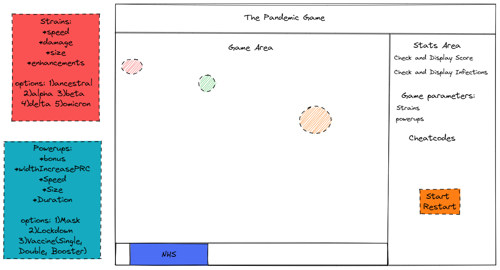
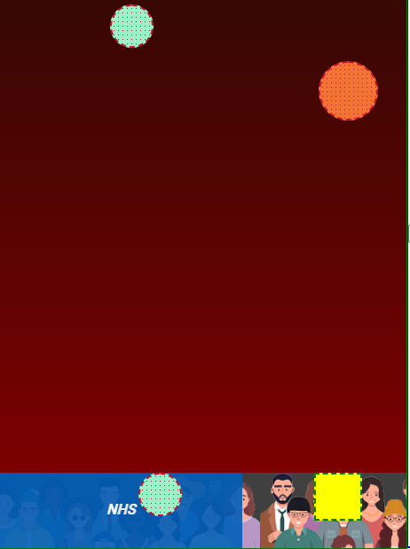
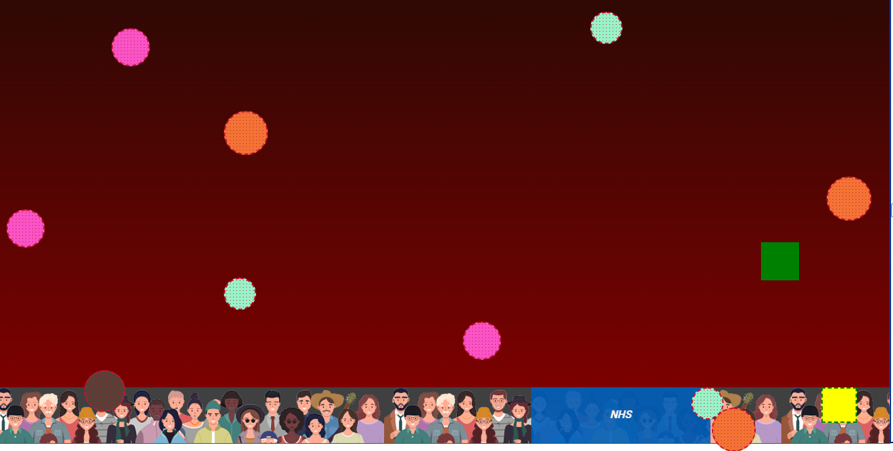

#  GA London SEI Project-1-The Pandemic Game

## TABLE OF CONTENTS

- [Overview](#overview)
  - [Brief](#brief)
  - [Technologies Used](#technologies)
  - [Installation](#installation)
  - [Demo](#demo)
- [Development](#development)
  - [Planning](#planning)
  - [Strains](#strains)
  - [Power-ups](#power-ups)
  - [Bar](#bar)
  - [Cheat Codes](#cheat-codes)
  - [Styling](#styling)
- [Difficulties and Wins](#difficulties-wins)
  - [Known Bugs](#bugs)
  - [Challenges and Wins](#challenges-wins)
- [Future Improvements](#future-improvements)
- [Key Learnings](#key-learnings)

## <a name='overview'>Overview</a>

The first project at General Assembly's (GA) Software Engineering Immersive (SEI-Flex) bootcamp was to build a game playable in a web browser using HTML, CSS and JavaScript.

I have decided to create a custom game, rather than recreating the most commonly selected projects - Battleships, Frogger, Pac-Man, Snake, Space-Invaders or Tetris.

The game was developed during the height of the Omicron wave and if hearing about COVID all day was not enough - I have chosen it as a subject of the first project.

The aim of the game is to protect as much population from COVID by navigating the NHS bar with `left` and `right` arrows.

Just as in real life - you cannot protect everyone within the population from getting infected - hence you need to pick your battles. At the beginning of the game - that means picking virus hotspots, later in the game - it is trying to protect the population from the most recent virus strains - they will be harder to spot, harder to catch, but will reward with much more points!

Find the game too easy or too hard? Check out the Cheat Codes!

### <a name='brief'>Brief</a>

Timeframe of two weeks to complete a solo project as part of GA's SEI-Flex course for individuals having a full-time job.

Requirements for the game:

- Be rendered in a browser.
- Logic for winning and visual representation of winning.
- Option to restart the game without reloading the page.
- Use JavaScript for DOM manipulation.
- Deploy the game online.
- Use Semantic Mark-up for HTML and CSS.

### <a name='technologies'>Technologies Used</a>

- JavaScript
- HTML5
- CSS3
- GitHub
- VSCode

### <a name='installation'>Installation</a>

- Clone the repo
- Run index.html
- Show your best decision making skills to survive the pandemic!

### <a name='demo'>Demo</a>

Insert demo capture

**The game can be played [here](https://rodages.github.io/Project-One-The-Pandemic-Game/).**

## <a name='development'>Development</a>

### <a name='planning'>Planning</a>



Sketch visualisation and the main aspects of the game.

The first few days were spent on planning, writing the state parameters, choosing the cheat codes' functionality/names and implementing the skeleton HTML layout.

The plan was to have basic functionality complete by the beginning of the first week:

- virus nodes should be able to fall and appear randomly.
- the bar should register when the virus lands within its width.
- score or infections should get increased depending on where the virus lands.

The first component to function properly was the NHS bar, however, at that point, it did not have any styling. I had some issues with the bar going out from the game area, but luckily the issues were quickly resolved.

The second aspect of the game that was completed - cheat codes - Although it was a stretch goal, I was very passionate about this functionality for reasons explained in the `wins` section.

Initially, the virus object was initialised as a `ball` and even till now some components and styles are named misleadingly. This was the third working part, where I falsely believed that the project was finished as it only required minor upgrades.

By the end of the first week I had completed my base MVP, but the game was lagging a lot and had very basic styling. The instructor suggested reading about `requestAnimationFrame`, which was a big game-changer to make the game playable. The code was refactored and further stretch goals were worked on.

The second week was focused on planning the thresholds for different strains, and powerups and fixing the bugs that came with each implementation of a new feature.

Firstly I have spent more time on styling. This helped differentiate different virus strains and made the game look much better and enjoyable, although the game has not been finished styling even until now.

With more advanced styling in place, I have implemented different virus strains.

Most of the week has been spent on working and fixing bugs that came together with implementing the powerups. I was considering adding additional cheat code granting `n` amount of points - hence had to write a lot of code on how to tackle bugs of edge cases of suddenly getting a high increase of extra points rather than going through natural game progression.

On the final days, I was working on tying the cheat codes together with actual gameplay, implementing restart functionality and fixing minor bugs.

### <a name='functionality'>Game Functionality</a>

The play area would be split into two - the right side to display statistics and information, and the left for the game play area.

The idea is that as with COVID - the game will start slowly, but with every infection appearing - the intensity will increase. The game has limitations on the increase of intensity - as otherwise the screen would get completely spammed with new nodes soon after the start and would not be interesting to play.

When the player collects points by navigating the NHS bar to catch the virus - the game progresses. Each virus strain and each powerup has its own thresholds for appearing in the game. These new features will reward the player with more points if collected or will cause more damage if missed.

The game is played until 10000 points to win or 10000 infections to lose.

Below follows a breakdown of the main aspects of the game.

### <a name='strains'>Strains</a>

```
const strainsArr = ["ancestral", "alpha", "beta", "gamma", "delta", "omicron"]
```

Data for strains is listed inside `strainsObj` object. To access it - index for required strain is being passed to `strainsArr`: `strainsObj[strainsArr[index]]`.

`strainsObj` has the following details:

- `name` - strain name
- `speed` - determines how quickly the strain will be falling compared to standard strain.
- `damagePoints` - the number of points that will be collected by successfully positioning the bar or the number of points lost if the strain is missed.
- `size` - determines the size of the strain compared to the default.
- `enhancements` - array with classes determining strain-specific exceptional values and styling.

### <a name='power-ups'>Power-Ups</a>

```
const powerUpsArr = ["mask", "lockdown", "vaccine"]
const jabsList = ["single","double","booster"];
```

Data for power-ups is listed inside `powerUpsObj`. To access it - index for required powerup is being passed to `powerUpsArr` :
`powerUpsObj[powerUpsArr[index]]`

- `bonusPointsPercent` - a value by which regular points are going to be multiplied..
- `barWidthPercent` - determines the percentage by which the standard game bar would get increased. The game does not combine power-ups but rather increases the width based on the "strongest" power-up.
- `speed` - determines how quickly the power-up will be falling compared to standard strain.
- `size` - determines the size of the power-up compared to the default strain.
- `enhancements` - classes used for styling only
- `powerUpDuration` - in ms - determines how long the power-up is going to remain active.
- `recurrence` - in ms - determines how frequently power-ups are going to appear.

`vaccine` has base parameters of `speed`, `size`, `enhancements`, `recurrence`, while `bonusPointsPercent`, `barWidthPercent`, `powerUpDuration` and `threshold` stats are listed for different levels of vaccine - `single`, `double`, `booster`.

### <a name='bar'>NHS Bar</a>

```
//PLAYAREA PARAMS
const playArea = {
    //"px" needs to be added when used
    height:gameField.scrollHeight,
    width: gameField.scrollWidth,
    collisionPoint:parseInt(gameField.scrollHeight/100*90)
}
//BAR PARAMS
const barObject = {
    //when used "px" needs to be added
    width: Math.round(playArea.width / 5),
    left:playArea.width/2-(playArea.width/20),
}
```

By default NHS BAR is set to have 1/5 of total gameplay width. It can temporarily increase by collecting power-ups - the higher level of power-up - the greater the increase. Another way of increasing the width is by using `ienjoycheating` cheat code to permanently increase the bar to maximum gameplay width - it will only shrink to previous size, if `fairplayforall` will get entered.

### <a name='cheat-codes'>Cheat Codes</a>

- `ienjoycheating` - Expands the NHS bar to the maximum width.
- `fairplayforall` - Brings back the NHS bar to original size.
- `iwantmyfreedom` - Removes all powerups from the game and allows the virus to spread uncontrollably.
- `doitfortheteam` - Brings back the powerups.
- `iwantitovernow` - Grants you maximum points to end the game. All you had to do is ask!

### <a name='styling'>Styling</a>

The project has very minimal styling.

All virus strains have different colours and gradients - but after implementing dot background pattern on each ball to make it look more like virus - the gradients fall back to background colour instead.

```
.mask{
    background:green
}
.lockdown{
    background:blue
}
.vaccine{
    background:yellow;
}

```

Power Ups were supposed to be styled to represent actual items, but due to lack of time were just left as square boxes with different colours.

## <a name=bugs-wins'>Bugs and Wins</a>

### <a name='bugs'>Known Bugs</a>


Sometimes, especially if the computer is getting slow, or is overheating - some elements get stuck below the NHS line instead of disappearing from the screen after points collection/damage.


If the user changes from the tab running the game to another, and comes back to play the game - the newly rendered items are being rendered on top of the initial play area and just continue falling down the viewport instead of being cleared once they hit points collection/damage line.

### <a name='challenges-wins'>Challenges and Wins</a>

The project has lots of state and parameters that change as the game progresses. I believe that is quite a big accomplishment for a first project as most beginner games focus only on a few moving pieces.

```
const state = {
    highscore:null,
    currentPoints: 0,
    currentInfections:0,
    goalPoints:10000,
    cheatcodes:["ienjoycheating","fairplayforall","iwantmyfreedom","doitfortheteam","iwantitovernow"],
    cheatCodeArr: [],
    currentStrains: ["ancestral"],
    currentPowerUps: [],
    currentJabsList:[],
    collectedJabs: [],
    collectedPowerUps: [],
    emergencyStop:false,
    maxJabs: 0,
    intensity:1000,
    mask:false,
    lockdown:false,
    single:false,
    double:false,
    booster:false,
    gameWon:false,
    gameLost:false,
    gameActive:false,
    cheats : {
        cheatBar:{
            active:null,
            oldBarWidth:null,
        },
        powerUps:{
            empty:[],
            default:["mask", "lockdown", "vaccine"],
            old:[]
        }
    },
}

```

`window.requestAnnimationFrame` allowed to have smooth virus/powerup drops throughout the application at scale. Before refactoring the code and using `setTimeout` - the computer would overheat easily as soon as lots of nodes would appear on the screen.

```
function startDropping(){
    let start, nextDrop

    function spawn(timestamp){
        const strain = randomElementOfArray(state.currentStrains)
        stateObj = {...state}
        if(!start){
            start = timestamp
        }
        if(!nextDrop){
            nextDrop = state.intensity
        }
        timepassed = timestamp - start

        if(timepassed>nextDrop){
            nextDrop=timepassed+stateObj.intensity
            dropElement(createElement,strain,stateObj.currentStrains,strainsObj,"ball")
        }
    //condition to continue
        if(!state.gameWon&&!state.gameLost){
            requestAnimationFrame(spawn)
        }
    }
    window.requestAnimationFrame(spawn)
}
```

Depending on currently selected powerups and the virus strain that is about to be dropped - the game regulates the intensity at which the upcoming drop will happen again.

```
function updateIntensity(strain, state) {
    const stateObj = { ...state }
    let reducePoints = strainsObj[strain].damagePoints


    if (stateObj.lockdown) {
        reducePoints = parseInt(reducePoints/3)
    }
    if (stateObj.booster) {
        reducePoints /= 3
    }
    if (stateObj.mask) {
        reducePoints -= 5
    }
    if (strain === "omicron" || strain === "gamma") {
        stateObj.intensity = stateObj.intensity - reducePoints
    } else {
        if (stateObj.double) {
            reducePoints /=2
        } else if (stateObj.single) {
            reducePoints -= 5
        }
        stateObj.intensity = stateObj.intensity - reducePoints
    }
    //safeguards from getting too intensive
    if (stateObj.intensity < 500) {
        stateObj.intensity = 500
    }
    return stateObj.intensity
}
```

`GTA: Vice City` was the first game where I saw cheat codes available when my friend showed me the game for the first time on his computer. I was very impressed and unfortunately, as I was not very good at the game - I had to use the codes to complete the game. When creating this game - I really wanted to implement the same functionality!

```
function addLetterToCheatCodeArr(letter){
    if(state.cheatCodeArr.length<14){
        //adds letter to the array
        state.cheatCodeArr=[...state.cheatCodeArr,letter]
        //test
        if(state.cheatCodeArr.length==14){
            if(state.cheatcodes.includes(state.cheatCodeArr.join(""))){
                executeCheatCode(state.cheatCodeArr.join(""))
            }

            //function to execute cheatcode with switch statement
        }
    }else if(state.cheatCodeArr.length==14){
        //discards first letter, adds current letter to cheatcode array
        state.cheatCodeArr = [...state.cheatCodeArr.slice(1),letter]
        //checks if cheatcodecriteria has been met
        if(state.cheatcodes.includes(state.cheatCodeArr.join(""))){
            executeCheatCode(state.cheatCodeArr.join(""))
        }
        //function to execute cheatcode with switch statement
    }
    else{
        console.log("something went wrong")
        console.log(letter)
        console.log(state.cheatCodeArr)
    }
}


```

## <a name='future-improvements'>Future improvements</a>

- At the moment there are two `requestAnimation

- I have had a long list of features that I wanted to implement, hence the game has only basic styling.

- I had the plan to implement further features to some strains with certain enhancements:

  - `"split"` - Would split the virus node into two and make them fall diagonally rather than vertically down. The class would only be active if `lockdown` or `vaccine` powerups were not collected.
  - `"fade"` - At the top of the page, the virus would be solid, but would become more transparent when reaching the crowd level. The class would only be active if `lockdown` or `vaccine` powerups were not collected.
  - `"resistant"` - Would make `lockdown` and `vaccine` powerups ineffective.

- At the moment the game only works on Desktop - draggable NHS bar could allow mobile play.

- Currently the NHS bar just expands and shrinks without any animation - This can lead to some unexpected point drop.

- Implement timer visualisation to notify the player of the remaining duration of `powerups`

## <a name='key-learnings'>Key Learnings</a>

- Importance of making MVP first and adding extra features later. During the last project day, I worked under lots of pressure and stayed up till late to deliver the main aspects of the project, as I was too focused on continuously adding new features and fixing bugs that came along with them.

- I have learned more about DOM manipulation and debugging.

- Project helped me to understand the importance of breaking down code into smaller chunks and splitting it into separate files. It was quite difficult to follow the code at times when I had to navigate from top to bottom.

- I was really excited about the game and spent a significant amount of time thinking of edge cases, extra features, and even actual statistics and information about COVID strains - this led to a lot of time spent on irrelevant information/buggy features.

- Project worked well with the `setTimeout` function until it scaled to high intensity. `RequestAnimationFrame` allowed the project to function on a high load without lag and taught an important lesson to write efficient code rather than just implementing the first possible solution.

- This was the first project where I had some support from the senior developers. It was a very valuable experience to go through code reviews and it improved my ability to talk through the code and not only write it.

- Even when I was at work, or doing other activities - I was thinking about the project, features and code - which made me feel happy. As I knew - this is something that I want to do professionally!
